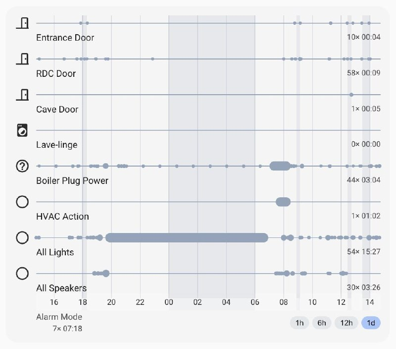

# Seagull History Card

Custom Lovelace card for Home Assistant to display entity history in compact visual styles.



Current styles:
- `pearls` — timeline line with pearls when a strong value appears (short events are preserved).
- `bars` — active/strong state is shown as rectangular bars from event start to event end.

Planned next styles: density, stepped segments.

## Installation

Add resources:

```yaml
url: /local/seagull-history-card-loader.js
type: module
```

Copy these files to `/config/www`:
- `seagull-history-card.js`
- `seagull-history-card-loader.js`

## Basic config

```yaml
type: custom:seagull-history-card
title: Living room history
period: 12h
style: pearls
entities:
  - entity: light.living_room
  - entity: switch.tv
```

## Options

- `period`: `1h`, `2h`, `12h`, `1d`, `2d`, `1w`, etc. or array like `["1h", "6h", "12h", "1d"]` for in-card scale switcher
- `style`: `pearls` | `bars`
- `filter`: `none` (default) or number of seconds for stats merge window
  - if short gaps between active intervals are less than `filter`, they are merged in stats
  - example: `filter: 5`
- `entities`: array of entities or objects
  - `entity` (required)
  - `name` (optional)
  - `icon` (optional)
  - `as_background` (optional, boolean)
    - first `as_background: true` entity becomes global timeline background
    - its own row is hidden, its name is shown under the time axis
    - if multiple entities have `as_background: true`, click icon on another candidate row to switch active background
    - click active background name under the axis to return it to normal row mode (highlighted), then click its icon to set it back as background
    - stats are shown for each entity: entry count into displayed state and total time in that state for current period
    - for active background entity stats are shown under its name in footer
  - `filter` (optional, overrides card-level `filter` for this entity)
  - `show_state` (optional)
    - string: `show_state: on`
    - common color for multiple values:
      ```yaml
      show_state:
        values: [open, unlocked]
        color: red
      ```
    - per-value color:
      ```yaml
      show_state:
        - value: open
          color: red
        - value: unlocked
          color: blue
      ```
  - `show_not_state` (optional)
    - example: `show_not_state: unavailable`
  - `show_above` (optional)
    - example: `show_above: 25`
  - `show_below` (optional)
    - example: `show_below: 18`
  - default strong values (when `show_state` omitted):
    - `lock.*` -> `unlocked`
    - `cover.*` -> `open`/`opening`
    - `binary_sensor` door/window/opening/garage/lock classes -> `open`/`unlocked`/`on`
    - others -> `on`
- `theme`: theme overrides (palette and card params)

Card-level visual params (also overridable via `theme.card`):
- `border_radius`
- `border_width`
- `background_opacity`

## Local auto-deploy on commit

This repo includes Git hooks similar to `ha-seagull-room-card`:

```bash
./scripts/setup-hooks.sh
```

Then each commit runs `scripts/deploy-to-ha.sh` and copies card files to HA `/config/www`.
